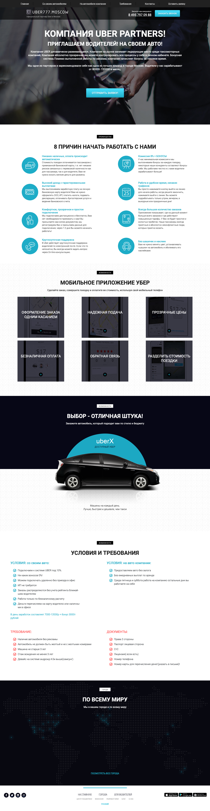

# Uber Moscow Project Udemy

## Table of contents

  - [Screenshot](#screenshot)
  - [Links](#links)
  - [Built with](#built-with)
- [Author](#author)

### Screenshot

### Link

- Live Site URL: [https://rafo38kh.github.io/uber_project/](https://rafo38kh.github.io/uber_project/)

### Built with

- Semantic HTML5 markup
- SCSS custom properties
- CSS Flexbox
- Bootstrap
- JavaScript
- SASS
- Mobile-first workflow

## Author

- GitHub - [@rafo38kh](https://github.com/rafo38kh)
- Codewars - [@rafo38kh](https://www.codewars.com/users/rafo38kh)
